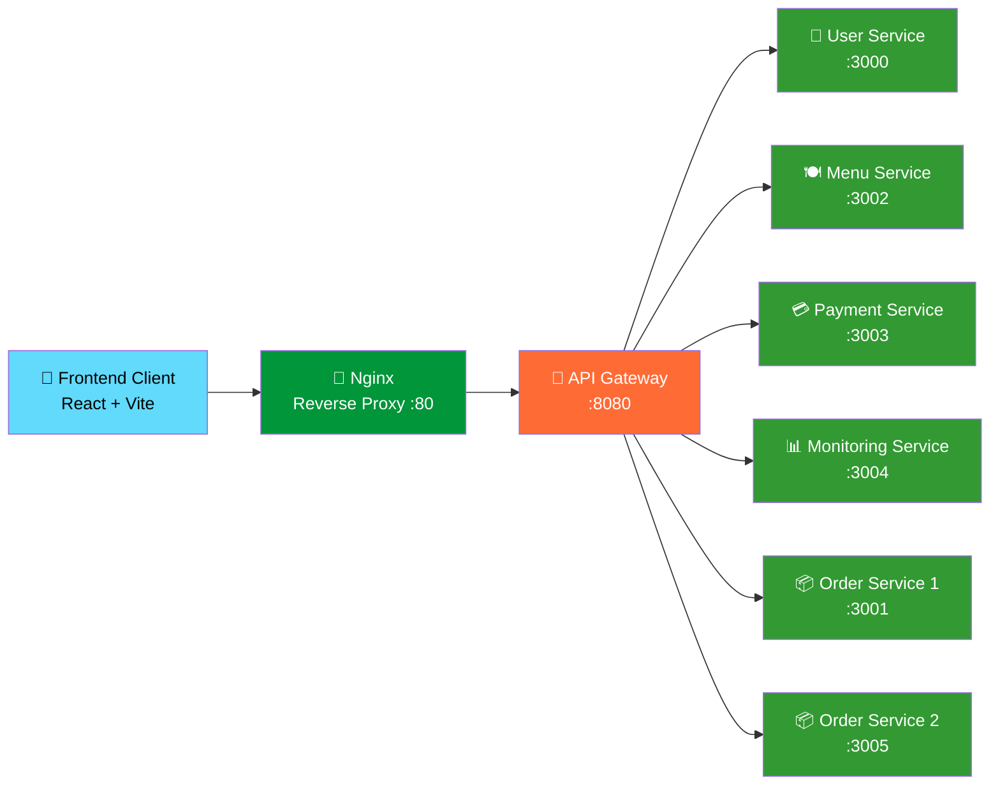

# 🍽️ Restaurant Microservices Platform

<p align="center">
  
  
  
  
  
  
</p>

<p align="center">
  
  
  
  
</p>

<p align="center">
  <b>Platform manajemen restoran terdistribusi yang dibangun menggunakan arsitektur Microservices,</b><br/>
  <b>API Gateway routing, Nginx reverse proxy, Docker containerization, dan realtime monitoring.</b>
</p>

---

## 📌 Daftar Isi

- [Gambaran Umum](#-gambaran-umum)
- [Arsitektur Sistem](#-arsitektur-sistem)
- [Daftar Layanan](#-daftar-layanan)
- [Tech Stack](#-tech-stack)
- [Struktur Proyek](#-struktur-proyek)
- [Fitur Aplikasi](#-fitur-aplikasi)
- [Instalasi & Menjalankan](#-instalasi--menjalankan)
- [Akses Aplikasi](#-akses-aplikasi)
- [API Endpoints](#-api-endpoints)
- [Health Check](#-health-check)
- [Docker Commands](#-docker-commands)
- [Skalabilitas](#-skalabilitas)
- [Roadmap](#-roadmap)
- [Author](#-author)

---

## ✨ Gambaran Umum

**Restaurant Microservices Platform** adalah sistem terdistribusi yang dirancang untuk mensimulasikan ekosistem restoran yang skalabel menggunakan prinsip-prinsip arsitektur cloud-native modern.

> 💡 **Apa itu Microservices?**
> Microservices adalah pendekatan arsitektur perangkat lunak di mana aplikasi dibangun sebagai kumpulan layanan kecil yang independen. Setiap layanan menjalankan proses tersendiri dan berkomunikasi melalui API. Berbeda dengan arsitektur monolitik yang menggabungkan semua fungsi dalam satu aplikasi besar.

### 🎯 Tujuan Utama Proyek

| Tujuan | Keterangan |
|--------|------------|
| 🏗️ Arsitektur Modular | Memisahkan setiap domain bisnis menjadi layanan yang mandiri |
| 📦 Containerisasi | Mengemas setiap layanan dalam Docker container yang portabel |
| 🔀 API Gateway | Memusatkan semua routing request ke satu pintu masuk |
| 📊 Monitoring | Memantau kesehatan dan performa setiap layanan secara realtime |
| ⚡ Skalabilitas | Memungkinkan scaling horizontal pada layanan tertentu saja |
| 🔧 Maintainability | Mempermudah pengembangan dan pemeliharaan tiap layanan secara terpisah |

---

## 🧠 Arsitektur Sistem



### 🔍 Penjelasan Alur Sistem

```
Pengguna → Nginx → API Gateway → Layanan Tujuan
   │           │         │              │
   │      (Port 80)  (Port 8080)   (Port 3000-3005)
   │           │         │              │
   └───────────┴─────────┴──────────────┘
              Satu jalur komunikasi terpusat
```

1. **Pengguna** membuka aplikasi melalui browser
2. **Nginx** menerima semua request masuk sebagai reverse proxy (pintu gerbang utama)
3. **API Gateway** meneruskan request ke layanan yang sesuai berdasarkan path URL
4. **Layanan Backend** memproses request dan mengembalikan response

### 🏛️ Komponen Utama

| Komponen | Fungsi | Keuntungan |
|----------|--------|------------|
| **Nginx** | Reverse proxy sebagai entry point tunggal | Keamanan, load balancing, SSL termination |
| **API Gateway** | Routing request ke layanan yang tepat | Centralized control, rate limiting |
| **Frontend** | Antarmuka pengguna berbasis React | UI responsif dan interaktif |
| **Order Cluster** | Dua instance order service aktif | Redundansi dan high availability |
| **Monitoring** | Pemantauan kesehatan sistem | Deteksi masalah secara real-time |
| **Docker Compose** | Orkestrasi semua container | Deployment mudah dan konsisten |

---

## 🚀 Daftar Layanan

| Layanan | Deskripsi | Port | Status |
|---------|-----------|------|--------|
| 🖥️ **Frontend** | Aplikasi utama pelanggan berbasis React | `5000` | ✅ Aktif |
| 🚪 **API Gateway** | Pusat routing semua request | `8080` | ✅ Aktif |
| 👥 **User Service** | Manajemen data pengguna | `3000` | ✅ Aktif |
| 🍽️ **Menu Service** | Manajemen menu restoran | `3002` | ✅ Aktif |
| 📦 **Order Service 1** | Instance pertama pemrosesan pesanan | `3001` | ✅ Aktif |
| 📦 **Order Service 2** | Instance kedua pemrosesan pesanan (replika) | `3005` | ✅ Aktif |
| 💳 **Payment Service** | Pemrosesan pembayaran | `3003` | ✅ Aktif |
| 📊 **Monitoring Service** | Pemantauan sistem dan kesehatan layanan | `3004` | ✅ Aktif |
| 🔀 **Nginx** | Reverse proxy dan load balancer | `80` | ✅ Aktif |

---

## 🛠️ Tech Stack

### 🎨 Frontend

| Teknologi | Kegunaan |
|-----------|----------|
| **React** | Library UI untuk membangun antarmuka pengguna yang interaktif |
| **Vite** | Build tool super cepat untuk pengembangan React |
| **TypeScript** | Superset JavaScript dengan static typing untuk kode yang lebih aman |
| **TailwindCSS** | Framework CSS utility-first untuk styling yang efisien |
| **Axios** | HTTP client untuk komunikasi dengan API backend |

### ⚙️ Backend

| Teknologi | Kegunaan |
|-----------|----------|
| **Node.js** | Runtime JavaScript untuk membangun server-side application |
| **Express.js** | Framework web minimalis untuk membuat REST API |
| **REST API** | Standar komunikasi antar layanan menggunakan HTTP |

### 🏗️ Infrastruktur

| Teknologi | Kegunaan |
|-----------|----------|
| **Docker** | Platform containerisasi untuk mengemas aplikasi beserta dependensinya |
| **Docker Compose** | Tool untuk mendefinisikan dan menjalankan multi-container Docker |
| **Nginx** | Web server dan reverse proxy berperforma tinggi |
| **Microservices** | Pola arsitektur untuk memecah aplikasi menjadi layanan-layanan kecil |

---

## 📂 Struktur Proyek

```bash
restaurant-microservices-main/
│
├── 📁 frontend/              # Aplikasi React (UI Pelanggan)
│   ├── src/
│   ├── package.json
│   └── Dockerfile
│
├── 📁 gateway/               # API Gateway (Routing Pusat)
│   ├── index.js
│   ├── package.json
│   └── Dockerfile
│
├── 📁 user/                  # User Service (Manajemen Pengguna)
│   ├── index.js
│   ├── package.json
│   └── Dockerfile
│
├── 📁 menu/                  # Menu Service (Manajemen Menu)
│   ├── index.js
│   ├── package.json
│   └── Dockerfile
│
├── 📁 order-service-1/       # Order Service Instance 1
│   ├── index.js
│   ├── package.json
│   └── Dockerfile
│
├── 📁 order-service-2/       # Order Service Instance 2 (Replika)
│   ├── index.js
│   ├── package.json
│   └── Dockerfile
│
├── 📁 payment/               # Payment Service (Pembayaran)
│   ├── index.js
│   ├── package.json
│   └── Dockerfile
│
├── 📁 monitoring/            # Monitoring Service (Pemantauan)
│   ├── index.js
│   ├── package.json
│   └── Dockerfile
│
├── 📁 nginx/                 # Konfigurasi Nginx Reverse Proxy
│   └── nginx.conf
│
├── 📄 docker-compose.yml     # Orkestrasi semua container
└── 📄 README.md
```

---

## 🔥 Fitur Aplikasi

### ✅ Fitur yang Sudah Tersedia

| Fitur | Keterangan |
|-------|------------|
| ✅ **Microservices Architecture** | Setiap domain bisnis dipisah menjadi layanan independen |
| ✅ **API Gateway Routing** | Semua request dikelola melalui satu gateway terpusat |
| ✅ **Docker Containerization** | Semua layanan berjalan dalam container yang terisolasi |
| ✅ **Nginx Reverse Proxy** | Entry point tunggal yang aman untuk semua traffic |
| ✅ **Monitoring Service** | Pemantauan kesehatan dan status semua layanan |
| ✅ **Order Service Cluster** | Dua instance order service untuk high availability |
| ✅ **Frontend Integration** | UI lengkap yang terintegrasi dengan semua layanan backend |
| ✅ **Health Check Endpoints** | Setiap layanan memiliki endpoint untuk pengecekan kesehatan |

### 🔄 Dalam Pengembangan

| Fitur | Keterangan |
|-------|------------|
| 🔄 **Manajemen Stok** | Sistem pengelolaan inventaris bahan makanan |
| 🔄 **Integrasi Database** | Koneksi ke PostgreSQL untuk penyimpanan data persisten |
| 🔄 **JWT Authentication** | Sistem autentikasi berbasis token yang aman |
| 🔄 **Dashboard Monitoring** | Tampilan visual yang lebih lengkap untuk monitoring |
| 🔄 **Sistem Analitik** | Laporan dan statistik transaksi restoran |

---

## ⚙️ Instalasi & Menjalankan

### 📋 Prasyarat

Pastikan software berikut sudah terinstal di komputer Anda:

| Software | Versi Minimum | Download |
|----------|---------------|----------|
| **Docker** | Latest | [docker.com](https://www.docker.com) |
| **Docker Compose** | Latest | Sudah termasuk dalam Docker Desktop |
| **Node.js** | >= 18 | [nodejs.org](https://nodejs.org) |
| **Git** | Latest | [git-scm.com](https://git-scm.com) |

### 🔍 Cara Mengecek Apakah Software Sudah Terinstal

```bash
# Cek versi Docker
docker --version

# Cek versi Docker Compose
docker compose version

# Cek versi Node.js
node --version

# Cek versi Git
git --version
```

---

### 📥 Langkah 1 — Clone Repository

Clone repository ini ke komputer lokal Anda:

```bash
git clone https://github.com/your-username/restaurant-microservices.git
```

> 💡 **Clone** berarti menyalin seluruh kode dari repository GitHub ke komputer Anda.

---

### 📁 Langkah 2 — Masuk ke Folder Proyek

```bash
cd restaurant-microservices-main
```

---

### 🐳 Langkah 3 — Build dan Jalankan Semua Container

Perintah ini akan membangun semua image Docker dan menjalankan semua layanan sekaligus:

```bash
docker compose up --build
```

> ⏳ **Proses build pertama kali** membutuhkan waktu beberapa menit karena Docker perlu mengunduh semua dependensi. Build selanjutnya akan jauh lebih cepat.

---

### 🔄 Langkah 4 — Menjalankan di Background (Opsional)

Jika Anda ingin menjalankan semua container di background tanpa memblokir terminal:

```bash
docker compose up -d
```

> 💡 Flag `-d` berarti **detached mode** — container berjalan di latar belakang.

---

### 🛑 Menghentikan Semua Container

```bash
docker compose down
```

---

## 🌍 Akses Aplikasi

Setelah semua container berjalan, akses layanan melalui URL berikut:

| Layanan | URL | Keterangan |
|---------|-----|------------|
| 🔀 **Nginx Proxy** | [http://localhost](http://localhost) | Entry point utama aplikasi |
| 🖥️ **Frontend** | [http://localhost:5000](http://localhost:5000) | Antarmuka pengguna React |
| 🚪 **API Gateway** | [http://localhost:8080](http://localhost:8080) | Gateway pusat semua API |
| 👥 **User Service** | [http://localhost:3000](http://localhost:3000) | Layanan manajemen pengguna |
| 🍽️ **Menu Service** | [http://localhost:3002](http://localhost:3002) | Layanan manajemen menu |
| 💳 **Payment Service** | [http://localhost:3003](http://localhost:3003) | Layanan pembayaran |
| 📊 **Monitoring** | [http://localhost:3004](http://localhost:3004) | Dashboard monitoring sistem |
| 📦 **Order Service 1** | [http://localhost:3001](http://localhost:3001) | Instance pertama order |
| 📦 **Order Service 2** | [http://localhost:3005](http://localhost:3005) | Instance kedua order |

---

## 🔌 API Endpoints

Semua endpoint di bawah ini dapat diakses melalui API Gateway di `http://localhost:8080`

### 👥 User Service

```http
GET /user
```
Mengambil daftar semua pengguna yang terdaftar.

---

### 🍽️ Menu Service

```http
GET /menu
```
Mengambil seluruh daftar menu restoran yang tersedia.

---

### 📦 Order Service

```http
GET /order
```
Mengambil daftar semua pesanan yang masuk dan sedang diproses.

---

### 💳 Payment Service

```http
GET /payment
```
Mengambil data dan riwayat transaksi pembayaran.

---

### 📊 Monitoring Service

```http
GET /monitoring
```
Mengambil status dan informasi kesehatan semua layanan yang berjalan.

---

## ❤️ Health Check

Setiap layanan memiliki endpoint `/health` untuk memastikan layanan berjalan dengan baik. Hal ini berguna untuk monitoring otomatis dan load balancer.

### Cara Mengecek Kesehatan Layanan

```bash
# Cek kesehatan User Service
curl http://localhost:3000/health

# Cek kesehatan Menu Service
curl http://localhost:3002/health

# Cek kesehatan Order Service 1
curl http://localhost:3001/health

# Cek kesehatan Payment Service
curl http://localhost:3003/health

# Cek kesehatan Monitoring Service
curl http://localhost:3004/health
```

### Contoh Response Health Check

```json
{
  "status": "OK",
  "service": "User Service",
  "timestamp": "2024-01-01T12:00:00.000Z",
  "uptime": "5 minutes"
}
```

> ✅ Jika response mengembalikan `"status": "OK"` berarti layanan berjalan normal.

---

## 🐳 Docker Commands

Berikut adalah perintah-perintah Docker yang sering digunakan dalam proyek ini:

### 📋 Melihat Status Container

```bash
# Melihat semua container yang sedang berjalan
docker compose ps
```

---

### 📜 Melihat Log

```bash
# Melihat log semua layanan secara realtime
docker compose logs -f

# Melihat log layanan tertentu saja (contoh: gateway)
docker compose logs -f gateway

# Melihat log User Service
docker compose logs -f user

# Melihat log Order Service 1
docker compose logs -f order-service-1
```

> 💡 Flag `-f` berarti **follow** — log akan terus diperbarui secara realtime.

---

### 🔨 Rebuild Layanan Tertentu

Berguna ketika Anda mengubah kode pada satu layanan saja:

```bash
# Rebuild hanya layanan monitoring
docker compose up --build monitoring

# Rebuild hanya layanan gateway
docker compose up --build gateway
```

---

### 🔁 Restart Semua Layanan

```bash
docker compose restart
```

---

### 🧹 Membersihkan Container dan Image

```bash
# Menghentikan dan menghapus semua container
docker compose down

# Menghentikan, menghapus container beserta volume-nya
docker compose down -v

# Menghapus semua image yang tidak terpakai
docker image prune -a
```

---

## 📈 Skalabilitas

Proyek ini dirancang dengan mempertimbangkan **horizontal scalability**, yaitu kemampuan untuk meningkatkan kapasitas dengan menambah lebih banyak instance layanan, bukan dengan meningkatkan spesifikasi server.

### ⚡ Fitur Skalabilitas

| Fitur | Penjelasan |
|-------|------------|
| **Independent Services** | Setiap layanan dapat di-scale secara terpisah sesuai kebutuhan |
| **Stateless API** | API tidak menyimpan state, sehingga mudah direplikasi |
| **Order Service Cluster** | Sudah memiliki 2 instance order service yang siap melayani |
| **API Gateway** | Mendistribusikan traffic secara merata ke semua instance |
| **Docker-based** | Mudah menambah atau mengurangi instance hanya dengan satu perintah |

### 🔢 Contoh Scaling Order Service

Misalnya traffic pesanan sedang sangat tinggi, Anda bisa menambah instance order service:

```bash
# Menjalankan 3 instance Order Service 1 sekaligus
docker compose up --scale order-service-1=3

# Menjalankan 5 instance Order Service 1
docker compose up --scale order-service-1=5
```

> 💡 Dengan **API Gateway**, semua instance tersebut akan menerima traffic secara otomatis tanpa konfigurasi tambahan.

---

## 🗺️ Roadmap

### ✅ Phase 1 — Fondasi (Selesai)

> Membangun infrastruktur dasar microservices

- [x] Core Microservices (User, Menu, Order, Payment)
- [x] API Gateway sebagai routing terpusat
- [x] Docker & Docker Compose infrastructure
- [x] Nginx Reverse Proxy
- [x] Monitoring Service & Health Checks

---

### 🔄 Phase 2 — Penguatan (Dalam Pengembangan)

> Menambahkan fitur keamanan dan persistensi data

- [ ] Integrasi PostgreSQL untuk penyimpanan data persisten
- [ ] JWT Authentication untuk keamanan API
- [ ] Admin Dashboard yang lebih lengkap
- [ ] Manajemen Stok dan Inventaris

---

### 📋 Phase 3 — Optimasi & Produksi (Direncanakan)

> Mempersiapkan sistem untuk lingkungan produksi skala besar

- [ ] Redis Caching untuk performa yang lebih cepat
- [ ] Kubernetes Deployment untuk orkestrasi skala enterprise
- [ ] CI/CD Pipeline dengan GitHub Actions
- [ ] Prometheus & Grafana untuk monitoring visual
- [ ] Auto Scaling berdasarkan beban traffic

---

## 👨‍💻 Author

<p align="center">
  <b>Angelino Zuliano Hutapea</b><br/>
  Full Stack Developer • Microservices Enthusiast<br/><br/>
  <a href="https://github.com/your-username">
    
  </a>
  <a href="https://linkedin.com/in/your-profile">
    
  </a>
</p>

---

## 📄 Lisensi

Proyek ini dilisensikan di bawah **MIT License** — bebas digunakan, dimodifikasi, dan didistribusikan untuk keperluan apapun dengan tetap mencantumkan kredit kepada penulis asli.

---

<p align="center">
  ⭐ <b>Jika proyek ini bermanfaat, jangan lupa berikan bintang di GitHub!</b> ⭐<br/><br/>
  Dibangun dengan ❤️ menggunakan Microservices Architecture dan Docker Infrastructure
</p>
