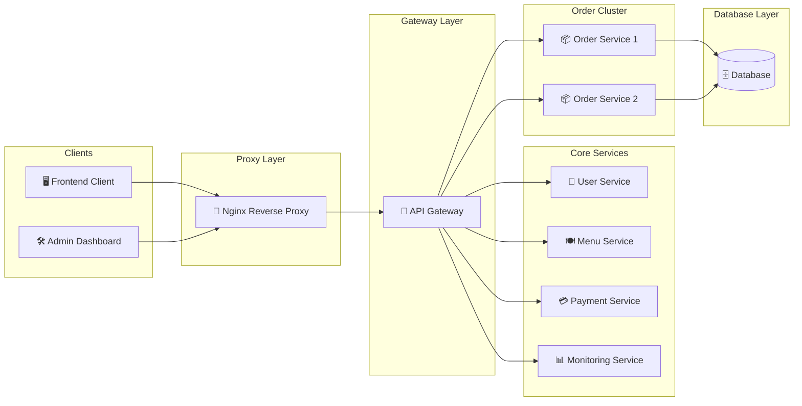

# 🍽️ Restaurant Microservices Platform

<p align="center">
  
  
  
  
  
  
  
  
</p>

<p align="center">
  A scalable distributed restaurant ecosystem built using Microservices Architecture,<br/>
  featuring API Gateway routing, Docker containerization, monitoring services, load balancing, and infrastructure visualization.
</p>

---

# 📌 Table of Contents

* [Overview](#-overview)
* [System Architecture](#-system-architecture)
* [Services](#-services)
* [Tech Stack](#-tech-stack)
* [Project Structure](#-project-structure)
* [Features](#-features)
* [Admin Dashboard](#-admin-dashboard)
* [Installation](#-installation)
* [Application Access](#-application-access)
* [Health Monitoring](#-health-monitoring)
* [Docker Commands](#-docker-commands)
* [Scalability Concept](#-scalability-concept)
* [Roadmap](#-roadmap)
* [Author](#-author)
* [License](#-license)

---

# ✨ Overview

The **Restaurant Microservices Platform** is a distributed application designed using modern microservices architecture principles.

The platform separates business domains into independent services to improve:

| Benefit                   | Description                                                |
| ------------------------- | ---------------------------------------------------------- |
| 🔧 Maintainability        | Each service can be updated independently                  |
| 📈 Scalability            | Services can scale horizontally based on demand            |
| 🛡️ Fault Isolation       | Failures are isolated between services                     |
| 🚀 Deployment Flexibility | Services can be deployed separately                        |
| 🔍 Monitoring             | Dedicated monitoring service for infrastructure visibility |
| ⚡ Performance             | Load balancing distributes traffic across services         |

This project demonstrates enterprise-level backend architecture using:

* API Gateway Pattern
* Reverse Proxy Architecture
* Dockerized Infrastructure
* HAProxy Load Balancing
* Monitoring Dashboard
* Microservices Separation
* React Frontend Applications
* Node.js Backend Services

---

# 🧠 System Architecture



## Architecture Highlights

* All incoming traffic enters through **Nginx Reverse Proxy**
* The **Gateway Service** handles centralized routing
* Business logic is separated into independent microservices
* Order processing is distributed across replicated services
* Monitoring service provides infrastructure visibility
* Docker ensures environment consistency across services

---

# 🚀 Services

| #  | Service            | Responsibility              | Default Port | Status   |
| -- | ------------------ | --------------------------- | ------------ | -------- |
| 1  | Frontend           | Customer-facing interface   | `5173`       | ✅ Active |
| 2  | Admin Frontend     | Infrastructure dashboard    | `4173`       | ✅ Active |
| 3  | Gateway            | API request routing         | `8080`       | ✅ Active |
| 4  | User Service       | User management             | `3000`       | ✅ Active |
| 5  | Order Service 1    | Order processing instance   | `3001`       | ✅ Active |
| 6  | Menu Service       | Menu management             | `3002`       | ✅ Active |
| 7  | Payment Service    | Payment processing          | `3003`       | ✅ Active |
| 8  | Monitoring Service | Infrastructure monitoring   | `3004`       | ✅ Active |
| 9  | Order Service 2    | Replicated order processing | `3005`       | ✅ Active |
| 10 | Nginx              | Reverse proxy               | `80`         | ✅ Active |

---

# 🛠️ Tech Stack

## 🎨 Frontend

| Technology   | Purpose                            |
| ------------ | ---------------------------------- |
| React        | Component-based frontend framework |
| Vite         | Frontend build tool                |
| TypeScript   | Type-safe frontend development     |
| TailwindCSS  | Utility-first CSS styling          |
| Axios        | API communication                  |
| React Router | Frontend routing                   |

---

## ⚙️ Backend

| Technology | Purpose               |
| ---------- | --------------------- |
| Node.js    | JavaScript runtime    |
| Express.js | Backend web framework |
| REST API   | Service communication |

---

## 🏗️ Infrastructure

| Technology         | Purpose                       |
| ------------------ | ----------------------------- |
| Docker             | Containerization              |
| Docker Compose     | Multi-container orchestration |
| Nginx              | Reverse proxy                 |
| HAProxy            | Load balancing                |
| Monitoring Service | Health visualization          |

---

## 🔮 Planned Technologies

| Technology       | Purpose                 |
| ---------------- | ----------------------- |
| PostgreSQL       | Relational database     |
| Redis            | Caching layer           |
| Kubernetes       | Container orchestration |
| Prometheus       | Metrics collection      |
| Grafana          | Monitoring dashboards   |
| RabbitMQ / Kafka | Event-driven messaging  |

---

# 📂 Project Structure

```bash
restaurant-microservices/
│
├── frontend/
│   ├── src/
│   ├── public/
│   ├── package.json
│   └── Dockerfile
│
├── admin-frontend/
│   ├── src/
│   ├── package.json
│   └── Dockerfile
│
├── gateway/
│   ├── index.js
│   ├── package.json
│   └── Dockerfile
│
├── user/
│   ├── index.js
│   ├── package.json
│   └── Dockerfile
│
├── menu/
│   ├── index.js
│   ├── package.json
│   └── Dockerfile
│
├── payment/
│   ├── index.js
│   ├── package.json
│   └── Dockerfile
│
├── monitoring/
│   ├── index.js
│   ├── package.json
│   └── Dockerfile
│
├── order-service-1/
│   ├── index.js
│   ├── package.json
│   └── Dockerfile
│
├── order-service-2/
│   ├── index.js
│   ├── package.json
│   └── Dockerfile
│
├── nginx/
│   └── nginx.conf
│
├── docker-compose.yml
└── README.md
```

---

# 🔥 Features

## ✅ Implemented Features

| Feature                    | Status        |
| -------------------------- | ------------- |
| Microservices Architecture | ✅ Implemented |
| API Gateway Routing        | ✅ Implemented |
| Docker Containerization    | ✅ Implemented |
| Nginx Reverse Proxy        | ✅ Implemented |
| HAProxy Load Balancing     | ✅ Implemented |
| Monitoring Service         | ✅ Implemented |
| Frontend Dashboard         | ✅ Implemented |
| Admin Dashboard            | ✅ Implemented |
| Service Separation         | ✅ Implemented |
| Health Check Endpoints     | ✅ Implemented |

---

## 🔄 In Progress Features

| Feature              | Status         |
| -------------------- | -------------- |
| Stock Management     | 🔄 In Progress |
| Database Integration | 🔄 In Progress |
| JWT Authentication   | 🔄 In Progress |
| Service Analytics    | 🔄 In Progress |
| Monitoring Charts    | 🔄 In Progress |

---

## 📋 Planned Features

| Feature                | Status     |
| ---------------------- | ---------- |
| PostgreSQL Replication | 📋 Planned |
| Redis Caching          | 📋 Planned |
| Kubernetes Deployment  | 📋 Planned |
| Prometheus Integration | 📋 Planned |
| Grafana Dashboard      | 📋 Planned |
| CI/CD Pipeline         | 📋 Planned |
| Auto Scaling           | 📋 Planned |
| Distributed Logging    | 📋 Planned |

---

# 🖥️ Admin Dashboard

The Admin Dashboard provides infrastructure visibility and operational management for the platform.

## Current Capabilities

| Feature                      | Description                        |
| ---------------------------- | ---------------------------------- |
| Service Monitoring           | Monitor microservice health status |
| Infrastructure Visualization | View architecture topology         |
| Real-time Status             | Track service availability         |
| Dashboard Interface          | Centralized admin interface        |

---

## Planned Dashboard Features

| Feature              | Description                     |
| -------------------- | ------------------------------- |
| Stock Management     | Inventory control system        |
| Revenue Analytics    | Financial dashboard             |
| CPU & RAM Monitoring | Resource utilization metrics    |
| Docker Monitoring    | Container health tracking       |
| Database Metrics     | Query and connection monitoring |
| User Analytics       | Activity and usage tracking     |

---

# ⚙️ Installation

## Prerequisites

Install the following:

| Tool           | Recommended Version |
| -------------- | ------------------- |
| Docker         | >= 24.x             |
| Docker Compose | >= 2.x              |
| Git            | Latest              |
| Node.js        | >= 18.x             |

---

## 1️⃣ Clone Repository

```bash
git clone https://github.com/your-username/restaurant-microservices.git
```

---

## 2️⃣ Enter Project Directory

```bash
cd restaurant-microservices
```

---

## 3️⃣ Start All Services

```bash
docker compose up --build
```

---

## 4️⃣ Run in Background

```bash
docker compose up -d
```

---

# 🌍 Application Access

| Application        | URL                                            |
| ------------------ | ---------------------------------------------- |
| Frontend           | [http://localhost:5173](http://localhost:5173) |
| Admin Dashboard    | [http://localhost:4173](http://localhost:4173) |
| Gateway API        | [http://localhost:8080](http://localhost:8080) |
| Monitoring Service | [http://localhost:3004](http://localhost:3004) |
| Nginx Proxy        | [http://localhost](http://localhost)           |

---

# 🔍 Health Monitoring

Each backend service exposes a standardized `/health` endpoint.

## Example

```bash
curl http://localhost:3000/health
```

---

## Example Response

```json
{
  "service": "User Service",
  "status": "OK",
  "timestamp": "2026-01-01T12:00:00.000Z"
}
```

---

## Health Endpoints

| Service            | Endpoint  |
| ------------------ | --------- |
| User Service       | `/health` |
| Menu Service       | `/health` |
| Payment Service    | `/health` |
| Monitoring Service | `/health` |
| Order Service 1    | `/health` |
| Order Service 2    | `/health` |
| Gateway            | `/health` |

---

# 🐳 Docker Commands

## Start Services

```bash
docker compose up
```

---

## Build Services

```bash
docker compose up --build
```

---

## Run Detached

```bash
docker compose up -d
```

---

## Stop Services

```bash
docker compose down
```

---

## View Running Containers

```bash
docker compose ps
```

---

## View Logs

```bash
docker compose logs -f
```

---

## View Specific Service Logs

```bash
docker compose logs -f gateway
```

---

## Scale Service

```bash
docker compose up --scale order-service-1=3
```

---

# 📈 Scalability Concept

This project is designed with scalability and modularity as primary architecture goals.

```text
Client Request
      │
      ▼
[ Nginx Reverse Proxy ]
      │
      ▼
[ API Gateway ]
      │
 ┌────┴───────────────┐
 │                    │
 ▼                    ▼
Core Services     Order Cluster
                     │
             ┌───────┴────────┐
             ▼                ▼
      Order Service 1   Order Service 2
```

---

## Key Scalability Properties

| Property           | Description                          |
| ------------------ | ------------------------------------ |
| Horizontal Scaling | Replicated order services            |
| Fault Isolation    | Services fail independently          |
| Stateless Services | Easier replication and scaling       |
| Gateway Routing    | Centralized request management       |
| Cloud-Native Ready | Architecture suitable for Kubernetes |
| Load Balancing     | Traffic distributed across services  |

---

# 🗺️ Roadmap

```text
Phase 1 — Foundation
✔ Microservices Architecture
✔ Docker Infrastructure
✔ Gateway Service
✔ Nginx Reverse Proxy
✔ Monitoring Dashboard
✔ Frontend Applications

Phase 2 — Backend Expansion
🔄 Database Integration
🔄 JWT Authentication
🔄 Stock Management
🔄 Analytics Features

Phase 3 — Observability
📋 Prometheus Integration
📋 Grafana Dashboards
📋 Distributed Logging
📋 Resource Monitoring

Phase 4 — Enterprise Infrastructure
📋 Kubernetes Deployment
📋 CI/CD Automation
📋 Auto Scaling
📋 Service Discovery
📋 Event Streaming
```

---

# 👨‍💻 Author

<p align="center">
  <b>Angelino Zuliano Hutapea</b><br/>
  Full Stack Developer • Microservices Enthusiast
</p>

<p align="center">
  Building scalable distributed systems using modern cloud-native architecture.
</p>

---

# ⭐ Support This Project

If you found this project useful:

```text
⭐ Star the repository
🍴 Fork the project
🐛 Open issues
🤝 Submit pull requests
📢 Share with the community
```

---

# 📄 License

This project is licensed under the MIT License.

You are free to use, modify, and distribute this software with attribution.

---

<p align="center">
  Built with using Microservices Architecture
</p>
