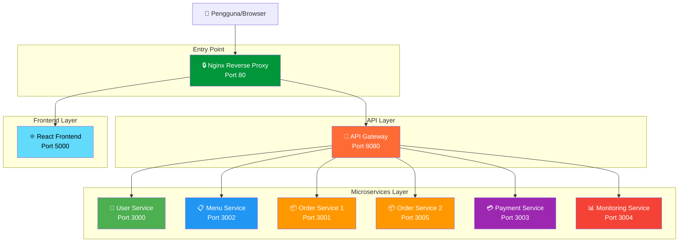

# 🍽️ Platform Microservices Restoran

<p align="center">
  
  
  
  
  
  
</p>

<p align="center">
  Platform manajemen restoran terdistribusi menggunakan Arsitektur Microservices,<br/>
  routing API Gateway, reverse proxy Nginx, kontainerisasi Docker, dan monitoring realtime.
</p>

---

## 📌 Daftar Isi

* [Gambaran Umum](#-gambaran-umum)
* [Apa itu Microservices?](#-apa-itu-microservices)
* [Arsitektur Sistem](#-arsitektur-sistem)
* [Daftar Layanan](#-daftar-layanan)
* [Teknologi yang Digunakan](#-teknologi-yang-digunakan)
* [Struktur Proyek](#-struktur-proyek)
* [Fitur-Fitur](#-fitur-fitur)
* [Panduan Instalasi](#-panduan-instalasi)
* [Cara Menjalankan Proyek](#-cara-menjalankan-proyek)
* [Akses Aplikasi](#-akses-aplikasi)
* [Endpoint API](#-endpoint-api)
* [Perintah Docker](#-perintah-docker)
* [Konsep Skalabilitas](#-konsep-skalabilitas)
* [Roadmap Pengembangan](#-roadmap-pengembangan)
* [Troubleshooting](#-troubleshooting)
* [Kontributor](#-kontributor)
* [Lisensi](#-lisensi)

---

## ✨ Gambaran Umum

**Platform Microservices Restoran** adalah sistem terdistribusi yang dirancang untuk mensimulasikan ekosistem restoran yang dapat diskalakan menggunakan prinsip-prinsip arsitektur cloud-native modern.

Aplikasi ini dipisahkan menjadi layanan-layanan independen sehingga setiap komponen dapat dikembangkan, di-deploy, dan diskalakan secara terpisah tanpa mengganggu layanan lainnya.

### 🎯 Tujuan Utama Proyek

| Tujuan | Keterangan |
|--------|------------|
| **Modularitas** | Membangun arsitektur backend yang terpisah-pisah berdasarkan domain bisnis |
| **Skalabilitas** | Kemampuan untuk menambah kapasitas sistem dengan mudah |
| **Maintainability** | Memudahkan pemeliharaan kode karena setiap service terpisah |
| **Teknologi Modern** | Menggunakan Docker, API Gateway, dan Nginx |
| **Monitoring** | Menyediakan pemantauan infrastruktur secara real-time |

---

## 🧩 Apa itu Microservices?

### Penjelasan Sederhana

Bayangkan sebuah restoran besar yang memiliki:
- **Dapur** → Menu Service
- **Kasir** → Payment Service  
- **Pelayan** → Order Service
- **Manager** → User Service
- **Supervisor** → Monitoring Service

Setiap bagian bekerja **secara independen** tetapi **saling berkomunikasi** untuk menjalankan restoran dengan baik.

### Keuntungan Microservices

✅ **Isolasi Kesalahan** - Jika satu service error, yang lain tetap jalan  
✅ **Pengembangan Paralel** - Tim berbeda bisa kerjakan service berbeda  
✅ **Skalabilitas Fleksibel** - Hanya scale service yang membutuhkan  
✅ **Teknologi Beragam** - Setiap service bisa pakai bahasa berbeda  
✅ **Deploy Independen** - Update satu service tanpa ganggu yang lain  

### Perbandingan dengan Monolith

| Aspek | Monolith | Microservices |
|-------|----------|---------------|
| **Struktur** | Satu aplikasi besar | Banyak aplikasi kecil |
| **Deployment** | Deploy semua sekaligus | Deploy per service |
| **Scaling** | Scale seluruh aplikasi | Scale service tertentu |
| **Technology** | Satu tech stack | Bisa beda-beda |
| **Complexity** | Simpel di awal | Kompleks di awal |
| **Maintenance** | Sulit saat besar | Lebih mudah |

---

## 🧠 Arsitektur Sistem

### Diagram Alur



### 📝 Penjelasan Komponen

| Komponen | Fungsi | Analogi |
|----------|--------|---------|
| **Nginx** | Reverse proxy yang menerima semua request dari luar | Satpam depan restoran |
| **API Gateway** | Routing request ke service yang tepat | Resepsionis yang arahkan tamu |
| **Frontend** | Antarmuka pengguna berbasis React | Menu digital untuk pelanggan |
| **User Service** | Kelola data pengguna, login, registrasi | Bagian membership |
| **Menu Service** | Kelola menu makanan dan minuman | Bagian dapur untuk daftar menu |
| **Order Service** | Proses pesanan (ada 2 instance untuk load balancing) | Pelayan yang terima pesanan |
| **Payment Service** | Proses pembayaran | Kasir |
| **Monitoring** | Pantau kesehatan semua service | Manager yang awasi semua |

---

## 🚀 Daftar Layanan

### Tabel Detail Service

| Nama Service | Port | Deskripsi Lengkap | Status |
|--------------|------|-------------------|--------|
| **Frontend** | `5000` | Aplikasi React untuk customer, menggunakan Vite + TypeScript | ✅ Production |
| **API Gateway** | `8080` | Pintu masuk semua request API, routing ke service terkait | ✅ Production |
| **User Service** | `3000` | Manajemen user, autentikasi, profil | ✅ Production |
| **Menu Service** | `3002` | CRUD menu makanan, kategori, harga | ✅ Production |
| **Order Service 1** | `3001` | Instance pertama untuk proses pesanan | ✅ Production |
| **Order Service 2** | `3005` | Instance kedua untuk load balancing | ✅ Production |
| **Payment Service** | `3003` | Proses pembayaran, invoice, history | ✅ Production |
| **Monitoring** | `3004` | Health check, metrics, status semua service | ✅ Production |
| **Nginx** | `80` | Reverse proxy dan load balancer | ✅ Production |

---

## 🛠️ Teknologi yang Digunakan

### Frontend Stack

| Teknologi | Versi | Kegunaan |
|-----------|-------|----------|
| **React** | 18.x | Library UI untuk membangun interface |
| **Vite** | 5.x | Build tool yang super cepat |
| **TypeScript** | 5.x | Superset JavaScript dengan type safety |
| **TailwindCSS** | 3.x | Utility-first CSS framework |
| **Axios** | 1.x | HTTP client untuk konsumsi API |

### Backend Stack

| Teknologi | Versi | Kegunaan |
|-----------|-------|----------|
| **Node.js** | 18+ | Runtime JavaScript di server |
| **Express.js** | 4.x | Framework web minimalis dan fleksibel |
| **REST API** | - | Arsitektur API untuk komunikasi |

### Infrastructure & DevOps

| Teknologi | Versi | Kegunaan |
|-----------|-------|----------|
| **Docker** | Latest | Kontainerisasi aplikasi |
| **Docker Compose** | Latest | Orkestrasi multi-container |
| **Nginx** | Latest | Reverse proxy dan load balancer |

---

## 📂 Struktur Proyek

```bash
restaurant-microservices-main/
│
├── 📁 frontend/                 # Aplikasi React
│   ├── src/
│   ├── public/
│   ├── package.json
│   ├── Dockerfile
│   └── vite.config.ts
│
├── 📁 gateway/                  # API Gateway
│   ├── src/
│   ├── package.json
│   └── Dockerfile
│
├── 📁 user/                     # User Service
│   ├── src/
│   │   └── index.js
│   ├── package.json
│   └── Dockerfile
│
├── 📁 menu/                     # Menu Service
│   ├── src/
│   ├── package.json
│   └── Dockerfile
│
├── 📁 payment/                  # Payment Service
│   ├── src/
│   ├── package.json
│   └── Dockerfile
│
├── 📁 monitoring/               # Monitoring Service
│   ├── src/
│   ├── package.json
│   └── Dockerfile
│
├── 📁 order-service-1/          # Order Service Instance 1
│   ├── src/
│   ├── package.json
│   └── Dockerfile
│
├── 📁 order-service-2/          # Order Service Instance 2
│   ├── src/
│   ├── package.json
│   └── Dockerfile
│
├── 📁 nginx/                    # Konfigurasi Nginx
│   ├── nginx.conf
│   └── Dockerfile
│
├── 📄 docker-compose.yml        # Orkestrasi semua container
├── 📄 .gitignore
└── 📄 README.md                 # Dokumentasi (file ini)
```

### Penjelasan Struktur

#### 🔹 `frontend/`
Berisi aplikasi React yang menjadi tampilan untuk pengguna akhir.

#### 🔹 `gateway/`
Service yang menerima semua request dari frontend dan meneruskannya ke service yang tepat.

#### 🔹 `user/`, `menu/`, `payment/`, `monitoring/`, `order-service-1/`, `order-service-2/`
Masing-masing adalah microservice independen dengan tanggung jawab spesifik.

#### 🔹 `nginx/`
Konfigurasi reverse proxy untuk routing HTTP.

#### 🔹 `docker-compose.yml`
File konfigurasi untuk menjalankan semua service sekaligus dengan satu perintah.

---

## 🔥 Fitur-Fitur

### ✅ Fitur yang Sudah Diimplementasikan

| Fitur | Status | Deskripsi |
|-------|--------|-----------|
| Arsitektur Microservices | ✅ | Pemisahan service berdasarkan domain |
| API Gateway Routing | ✅ | Routing otomatis ke service terkait |
| Docker Containerization | ✅ | Semua service berjalan di container |
| Nginx Reverse Proxy | ✅ | Load balancing dan routing HTTP |
| Monitoring Service | ✅ | Health check semua service |
| Multiple Order Instances | ✅ | 2 instance order service untuk high availability |
| Frontend Integration | ✅ | React app terintegrasi dengan backend |
| Health Check Endpoints | ✅ | Setiap service punya endpoint `/health` |

### 🔄 Fitur dalam Pengembangan

| Fitur | Status | Target |
|-------|--------|--------|
| Stock Management | 🔄 | Kelola stok bahan makanan |
| Database Integration | 🔄 | PostgreSQL untuk persistent data |
| JWT Authentication | 🔄 | Keamanan dengan token |
| Admin Dashboard | 🔄 | Panel admin untuk monitoring |
| Analytics System | 🔄 | Laporan penjualan dan statistik |

### 📋 Fitur Rencana Masa Depan

| Fitur | Status | Deskripsi |
|-------|--------|-----------|
| Redis Caching | 📋 | Cache untuk performa lebih cepat |
| Kubernetes | 📋 | Deployment ke K8s |
| CI/CD Pipeline | 📋 | Otomasi testing dan deployment |
| Prometheus & Grafana | 📋 | Monitoring dan visualisasi metrics |
| Auto Scaling | 📋 | Otomatis scale berdasarkan load |

---

## ⚙️ Panduan Instalasi

### Prasyarat yang Harus Diinstall

Pastikan komputer Anda sudah terinstall software berikut:

| Software | Versi Minimum | Link Download |
|----------|---------------|---------------|
| **Docker** | Latest | [Download Docker](https://www.docker.com/get-started) |
| **Docker Compose** | Latest | [Download Docker Compose](https://docs.docker.com/compose/install/) |
| **Node.js** | 18.x atau lebih | [Download Node.js](https://nodejs.org/) |
| **Git** | Latest | [Download Git](https://git-scm.com/) |

### Cara Cek Versi

```bash
# Cek versi Docker
docker --version

# Cek versi Docker Compose
docker compose version

# Cek versi Node.js
node --version

# Cek versi Git
git --version
```

---

### 📥 Langkah-Langkah Instalasi

#### **Langkah 1: Clone Repository**

Buka terminal/command prompt, lalu jalankan:

```bash
git clone https://github.com/your-username/restaurant-microservices.git
```

> 💡 **Catatan**: Ganti `your-username` dengan username GitHub Anda yang sebenarnya.

#### **Langkah 2: Masuk ke Folder Proyek**

```bash
cd restaurant-microservices-main
```

#### **Langkah 3: Verifikasi Struktur File**

Pastikan semua folder ada dengan perintah:

```bash
# Untuk Windows
dir

# Untuk Linux/Mac
ls -la
```

Anda harus melihat folder seperti: `frontend`, `gateway`, `user`, `menu`, dll.

---

## ▶️ Cara Menjalankan Proyek

### Metode 1: Jalankan Semua Service Sekaligus (Recommended)

#### **Build dan Jalankan**

```bash
docker compose up --build
```

**Penjelasan**:
- `docker compose up` → Jalankan semua container
- `--build` → Build ulang image Docker (gunakan saat pertama kali atau ada perubahan kode)

#### **Jalankan di Background**

Jika Anda ingin terminal tetap bisa digunakan:

```bash
docker compose up -d
```

**Penjelasan**:
- `-d` → Detached mode (berjalan di background)

#### **Lihat Logs**

```bash
docker compose logs -f
```

**Penjelasan**:
- `-f` → Follow mode (terus update logs real-time)

---

### Metode 2: Jalankan Service Tertentu

Jika Anda hanya ingin menjalankan beberapa service:

```bash
# Jalankan hanya frontend dan gateway
docker compose up frontend gateway

# Jalankan hanya monitoring
docker compose up monitoring
```

---

### 🛑 Cara Menghentikan Aplikasi

#### **Stop Semua Container**

```bash
docker compose down
```

#### **Stop dan Hapus Volume**

```bash
docker compose down -v
```

**Penjelasan**:
- `-v` → Hapus juga volume (data persistent)

#### **Stop dan Hapus Image**

```bash
docker compose down --rmi all
```

---

## 🌍 Akses Aplikasi

Setelah semua container berjalan, Anda bisa akses aplikasi melalui browser:

### Daftar URL Akses

| Service | URL | Keterangan |
|---------|-----|------------|
| **Nginx Proxy** | [http://localhost](http://localhost) | Entry point utama |
| **Frontend** | [http://localhost:5000](http://localhost:5000) | Aplikasi React |
| **API Gateway** | [http://localhost:8080](http://localhost:8080) | Gateway API |
| **User Service** | [http://localhost:3000](http://localhost:3000) | Service user |
| **Menu Service** | [http://localhost:3002](http://localhost:3002) | Service menu |
| **Order Service 1** | [http://localhost:3001](http://localhost:3001) | Service order instance 1 |
| **Order Service 2** | [http://localhost:3005](http://localhost:3005) | Service order instance 2 |
| **Payment Service** | [http://localhost:3003](http://localhost:3003) | Service payment |
| **Monitoring** | [http://localhost:3004](http://localhost:3004) | Service monitoring |

### Testing Akses

Buka browser dan coba akses:

```
http://localhost:5000
```

Anda akan melihat frontend aplikasi restoran.

---

## 🔌 Endpoint API

Berikut adalah endpoint yang tersedia di setiap service:

### 1️⃣ User Service (`http://localhost:3000`)

| Method | Endpoint | Deskripsi | Response |
|--------|----------|-----------|----------|
| `GET` | `/user` | Get semua user | `{ users: [...] }` |
| `GET` | `/health` | Health check | `{ status: "OK" }` |

**Contoh Request**:
```bash
curl http://localhost:3000/user
```

---

### 2️⃣ Menu Service (`http://localhost:3002`)

| Method | Endpoint | Deskripsi | Response |
|--------|----------|-----------|----------|
| `GET` | `/menu` | Get semua menu | `{ menus: [...] }` |
| `GET` | `/health` | Health check | `{ status: "OK" }` |

**Contoh Request**:
```bash
curl http://localhost:3002/menu
```

---

### 3️⃣ Order Service (`http://localhost:3001` atau `3005`)

| Method | Endpoint | Deskripsi | Response |
|--------|----------|-----------|----------|
| `GET` | `/order` | Get semua order | `{ orders: [...] }` |
| `GET` | `/health` | Health check | `{ status: "OK" }` |

**Contoh Request**:
```bash
curl http://localhost:3001/order
```

---

### 4️⃣ Payment Service (`http://localhost:3003`)

| Method | Endpoint | Deskripsi | Response |
|--------|----------|-----------|----------|
| `GET` | `/payment` | Get payment info | `{ payments: [...] }` |
| `GET` | `/health` | Health check | `{ status: "OK" }` |

**Contoh Request**:
```bash
curl http://localhost:3003/payment
```

---

### 5️⃣ Monitoring Service (`http://localhost:3004`)

| Method | Endpoint | Deskripsi | Response |
|--------|----------|-----------|----------|
| `GET` | `/monitoring` | Get status semua service | `{ services: [...] }` |
| `GET` | `/health` | Health check | `{ status: "OK" }` |

**Contoh Request**:
```bash
curl http://localhost:3004/monitoring
```

---

### ❤️ Health Check Semua Service

Setiap service memiliki endpoint health check:

```bash
# User Service
curl http://localhost:3000/health

# Menu Service
curl http://localhost:3002/health

# Order Service
curl http://localhost:3001/health

# Payment Service
curl http://localhost:3003/health

# Monitoring Service
curl http://localhost:3004/health
```

**Response**:
```json
{
  "status": "OK",
  "service": "User Service",
  "timestamp": "2024-01-15T10:30:00Z"
}
```

---

## 🐳 Perintah Docker

### Melihat Status Container

```bash
# Lihat container yang sedang berjalan
docker compose ps

# Lihat semua container (termasuk yang stopped)
docker compose ps -a
```

---

### Melihat Logs

```bash
# Lihat semua logs
docker compose logs

# Lihat logs real-time
docker compose logs -f

# Lihat logs service tertentu
docker compose logs -f gateway

# Lihat 100 baris terakhir
docker compose logs --tail=100
```

---

### Restart Service

```bash
# Restart semua service
docker compose restart

# Restart service tertentu
docker compose restart user

# Restart beberapa service
docker compose restart user menu payment
```

---

### Rebuild Service

```bash
# Rebuild semua service
docker compose up --build

# Rebuild service tertentu
docker compose up --build monitoring

# Rebuild tanpa cache
docker compose build --no-cache
```

---

### Masuk ke Container

```bash
# Masuk ke container user
docker compose exec user sh

# Masuk ke container frontend
docker compose exec frontend sh

# Jalankan command di container
docker compose exec user npm --version
```

---

### Menghapus Container dan Image

```bash
# Hapus semua container
docker compose down

# Hapus container dan volume
docker compose down -v

# Hapus container, volume, dan image
docker compose down -v --rmi all

# Hapus semua (termasuk orphan)
docker compose down -v --rmi all --remove-orphans
```

---

### Monitoring Resource

```bash
# Lihat penggunaan resource
docker stats

# Lihat resource container tertentu
docker stats user gateway
```

---

## 📈 Konsep Skalabilitas

### Apa itu Skalabilitas?

**Skalabilitas** adalah kemampuan sistem untuk menangani peningkatan beban dengan menambah resource.

### Jenis Skalabilitas

| Jenis | Penjelasan | Contoh |
|-------|------------|--------|
| **Vertical Scaling** | Menambah resource (CPU, RAM) pada satu server | Upgrade server dari 2 core ke 8 core |
| **Horizontal Scaling** | Menambah jumlah server/instance | Dari 1 instance jadi 5 instance |

Proyek ini menggunakan **Horizontal Scaling** ✅

---

### Fitur Skalabilitas dalam Proyek

#### 1. **Multiple Order Service Instances**

Dalam proyek ini, ada 2 instance Order Service:
- Order Service 1 (Port 3001)
- Order Service 2 (Port 3005)

Jika traffic tinggi, request akan didistribusikan ke kedua instance.

#### 2. **Stateless Services**

Semua service tidak menyimpan state di memory, sehingga bisa di-scale dengan mudah.

#### 3. **API Gateway**

Gateway berfungsi sebagai **load balancer** yang mendistribusikan request.

#### 4. **Docker-Based**

Dengan Docker, menambah instance semudah menjalankan container baru.

---

### Cara Scale Service

#### **Scale Order Service menjadi 5 Instance**

```bash
docker compose up --scale order-service-1=5
```

#### **Scale User Service menjadi 3 Instance**

```bash
docker compose up --scale user=3
```

#### **Scale Multiple Service**

```bash
docker compose up --scale user=3 --scale order-service-1=5
```

---

### Monitoring Saat Scale

Setelah scale, cek status:

```bash
# Lihat semua container
docker compose ps

# Monitor resource
docker stats
```

---

## 🗺️ Roadmap Pengembangan

### 🟢 Phase 1: Foundation (SELESAI ✅)

| Fitur | Status | Keterangan |
|-------|--------|------------|
| Core Microservices | ✅ | User, Menu, Order, Payment, Monitoring |
| API Gateway | ✅ | Routing dan load balancing |
| Docker Infrastructure | ✅ | Containerization semua service |
| Reverse Proxy | ✅ | Nginx sebagai entry point |
| Monitoring Service | ✅ | Health check dan status |

---

### 🟡 Phase 2: Enhancement (SEDANG DIKERJAKAN 🔄)

| Fitur | Status | Target Selesai |
|-------|--------|----------------|
| PostgreSQL Integration | 🔄 | Q2 2024 |
| JWT Authentication | 🔄 | Q2 2024 |
| Admin Dashboard | 🔄 | Q2 2024 |
| Stock Management | 🔄 | Q3 2024 |
| Order History | 🔄 | Q3 2024 |

**Penjelasan**:
- Database untuk menyimpan data persistent
- JWT untuk keamanan autentikasi
- Dashboard admin untuk kelola semua data
- Stock management untuk tracking bahan baku

---

### 🔵 Phase 3: Advanced Features (RENCANA 📋)

| Fitur | Status | Target Selesai |
|-------|--------|----------------|
| Redis Caching | 📋 | Q4 2024 |
| Kubernetes Deployment | 📋 | Q4 2024 |
| CI/CD Pipeline | 📋 | Q4 2024 |
| Prometheus & Grafana | 📋 | Q1 2025 |
| Auto Scaling | 📋 | Q1 2025 |
| Message Queue (RabbitMQ) | 📋 | Q1 2025 |

**Penjelasan**:
- **Redis**: Cache untuk query yang sering diakses
- **Kubernetes**: Orchestration yang lebih advanced
- **CI/CD**: Otomasi testing dan deployment
- **Prometheus/Grafana**: Monitoring dan visualisasi
- **Auto Scaling**: Scale otomatis berdasarkan load
- **Message Queue**: Komunikasi asynchronous antar service

---

### 🟣 Phase 4: Production Ready (MASA DEPAN 🚀)

| Fitur | Status | Target |
|-------|--------|--------|
| Security Hardening | 📋 | Q2 2025 |
| Performance Optimization | 📋 | Q2 2025 |
| Load Testing | 📋 | Q2 2025 |
| Disaster Recovery | 📋 | Q3 2025 |
| Multi-Region Deployment | 📋 | Q3 2025 |

---

## 🔧 Troubleshooting

### ❌ Problem 1: Port Sudah Digunakan

**Error**:
```
Error: bind: address already in use
```

**Solusi**:
```bash
# Cek port yang digunakan (Windows)
netstat -ano | findstr :3000

# Cek port yang digunakan (Linux/Mac)
lsof -i :3000

# Matikan process yang menggunakan port
kill -9 <PID>
```

---

### ❌ Problem 2: Docker Compose Tidak Ditemukan

**Error**:
```
command not found: docker compose
```

**Solusi**:
```bash
# Install Docker Compose
# Windows/Mac: sudah include dalam Docker Desktop
# Linux:
sudo curl -L "https://github.com/docker/compose/releases/download/v2.20.0/docker-compose-$(uname -s)-$(uname -m)" -o /usr/local/bin/docker-compose
sudo chmod +x /usr/local/bin/docker-compose
```

---

### ❌ Problem 3: Container Terus Restart

**Error**:
Container status `Restarting`

**Solusi**:
```bash
# Lihat logs untuk cari error
docker compose logs <service-name>

# Contoh
docker compose logs user

# Rebuild image
docker compose up --build <service-name>
```

---

### ❌ Problem 4: Cannot Connect to Service

**Error**:
`ECONNREFUSED` atau `Connection refused`

**Solusi**:
```bash
# 1. Pastikan semua container running
docker compose ps

# 2. Cek network
docker network ls
docker network inspect restaurant-microservices-main_default

# 3. Restart semua service
docker compose restart
```

---

### ❌ Problem 5: Docker Out of Space

**Error**:
```
no space left on device
```

**Solusi**:
```bash
# Hapus unused container
docker container prune

# Hapus unused image
docker image prune

# Hapus semua unused resources
docker system prune -a

# Lihat penggunaan disk
docker system df
```

---

### ❌ Problem 6: Frontend Tidak Load

**Solusi**:
```bash
# 1. Cek logs frontend
docker compose logs frontend

# 2. Rebuild frontend
docker compose up --build frontend

# 3. Clear browser cache
# Tekan Ctrl + Shift + Delete di browser

# 4. Akses langsung tanpa nginx
http://localhost:5000
```

---

### 🆘 Cara Mendapatkan Bantuan

Jika masalah masih berlanjut:

1. **Buat Issue di GitHub**
   ```
   https://github.com/your-username/restaurant-microservices/issues
   ```

2. **Sertakan Informasi**:
   - Versi Docker: `docker --version`
   - Versi Docker Compose: `docker compose version`
   - OS: Windows/Mac/Linux
   - Logs error: `docker compose logs`

---

## 👨‍💻 Kontributor

### Author

<table>
  <tr>
    <td align="center">
      
      <br />
      <sub><b>Angelino Zuliano Hutapea</b></sub>
      <br />
      <sub>Full Stack Developer</sub>
      <br />
      <sub>Microservices Enthusiast</sub>
    </td>
  </tr>
</table>

### Cara Berkontribusi

Kami sangat terbuka untuk kontribusi! Berikut langkahnya:

1. **Fork Repository**
   ```bash
   # Klik tombol "Fork" di GitHub
   ```

2. **Clone Fork Anda**
   ```bash
   git clone https://github.com/your-username/restaurant-microservices.git
   ```

3. **Buat Branch Baru**
   ```bash
   git checkout -b feature/fitur-baru
   ```

4. **Commit Changes**
   ```bash
   git add .
   git commit -m "Menambahkan fitur baru"
   ```

5. **Push ke GitHub**
   ```bash
   git push origin feature/fitur-baru
   ```

6. **Buat Pull Request**
   - Buka repository di GitHub
   - Klik "New Pull Request"
   - Jelaskan perubahan yang Anda buat

---

## 📞 Kontak

| Platform | Link |
|----------|------|
| 📧 Email | angelino.hutapea@example.com |
| 💼 LinkedIn | [linkedin.com/in/angelino-hutapea](https://linkedin.com/in/angelino-hutapea) |
| 🐙 GitHub | [github.com/angelino-hutapea](https://github.com/angelino-hutapea) |
| 🌐 Portfolio | [angelino-hutapea.dev](https://angelino-hutapea.dev) |

---

## 📄 Lisensi

Proyek ini dilisensikan di bawah **MIT License**.

### Apa yang Boleh Dilakukan?

✅ Gunakan untuk proyek komersial  
✅ Modifikasi sesuai kebutuhan  
✅ Distribusikan ulang  
✅ Gunakan untuk pembelajaran  

### Yang Harus Dilakukan

⚠️ Sertakan copyright notice  
⚠️ Sertakan lisensi MIT  

---

## 🎓 Pembelajaran

### Yang Bisa Dipelajari dari Proyek Ini

| Konsep | Level | Keterangan |
|--------|-------|------------|
| **Microservices Architecture** | ⭐⭐⭐ | Pemisahan service berdasarkan domain |
| **Docker Containerization** | ⭐⭐⭐ | Membuat dan manage container |
| **API Gateway Pattern** | ⭐⭐ | Routing dan load balancing |
| **Reverse Proxy** | ⭐⭐ | Nginx configuration |
| **RESTful API** | ⭐⭐ | Desain API yang baik |
| **React Frontend** | ⭐⭐ | Modern frontend development |
| **DevOps Practices** | ⭐⭐⭐ | CI/CD, monitoring, scaling |

---

## 📚 Referensi

### Dokumentasi Resmi

- [Docker Documentation](https://docs.docker.com/)
- [Docker Compose Documentation](https://docs.docker.com/compose/)
- [Nginx Documentation](https://nginx.org/en/docs/)
- [Node.js Documentation](https://nodejs.org/en/docs/)
- [React Documentation](https://react.dev/)
- [Express.js Documentation](https://expressjs.com/)

### Tutorial Recommended

- [Microservices Architecture by Martin Fowler](https://martinfowler.com/articles/microservices.html)
- [Docker for Beginners](https://docker-curriculum.com/)
- [Nginx Tutorial](https://nginx.org/en/docs/beginners_guide.html)

---

## 🎉 Terima Kasih

Terima kasih telah menggunakan **Restaurant Microservices Platform**!

Jika proyek ini bermanfaat, jangan lupa:

⭐ **Star repository ini di GitHub**  
🔔 **Watch untuk update terbaru**  
🍴 **Fork untuk eksperimen sendiri**  
📢 **Share ke teman-teman developer**  

---

<p align="center">
  <strong>Built with ❤️ using Microservices Architecture and Docker</strong>
  <br/>
  <sub>© 2024 Angelino Zuliano Hutapea. All rights reserved.</sub>
</p>

<p align="center">
  
  
  
</p>
